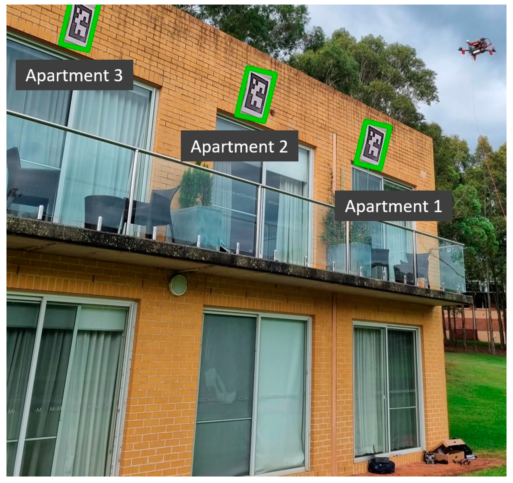
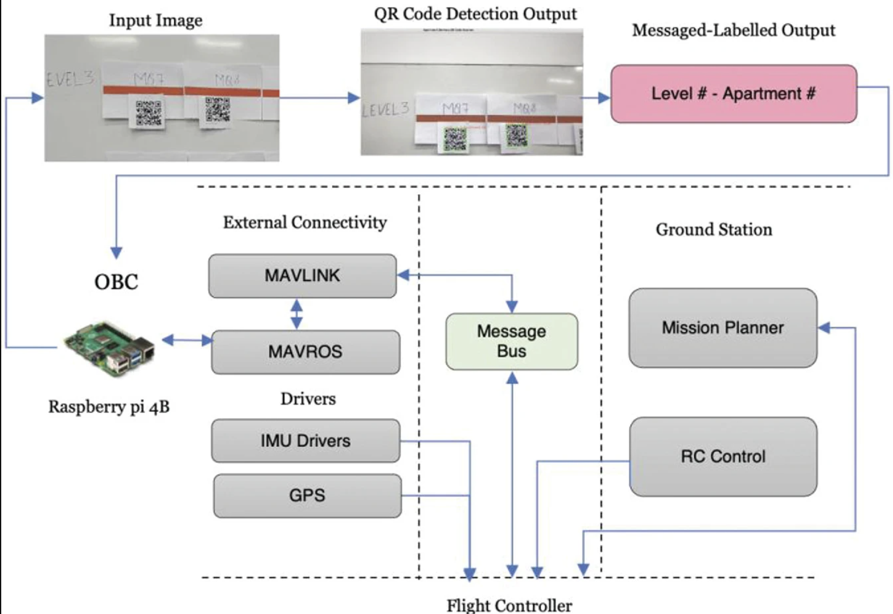

# Robotics Research Engineer & Ph.D. Candidate

- **Coding Languages**: Python, C/C++, HTML, MATLAB
- **Software Expertise**: ROS, Gazebo, Fusion 360 (CAD)
- **Hardware Mastery**: 
  - SBCs: Raspberry Pi, Jetson Nano
  - Embedded Platforms: Arduino, Teensy, ESP32
  - Flight Control: Pixhawk
  - Sensor Tech: RPLidar, IMU, Cameras
- **AI & ML**: YOLOv5, OpenCV
- **Tools**: Latex Overleaf, VS Code, GitHub

## 🎓 Education

### Macquarie University, Sydney
- 🤖 **Ph.D. in Robotics Engineering**  
  _Feb 2022 - Present_
- 🤖 **M.Res in Robotics Engineering**  
  _Feb 2021 - Dec 2021_
- 🛠 **M.Engg in Electronics Engineering**  
  _Feb 2019 - Dec 2020_

### Mumbai University
- 🛠 **B.Engg in Electronics Engineering**  
  _July 2013 - July 2017_

### Mithibai College
- 🧪 **HSC in Science**  
  _July 2011 - June 2013_		

## 🛠 Work Experience

### 🎓 Research @ Macquarie University

#### 🚁 [Autonomous Drone Landing Project](https://skyy.network/partners/)  
_Sept 2022 - Present_  
- Engaged in an ARC-funded collaboration between Macquarie University's Computing Department and Skyy Network, an Aviation and Aerospace company.
- Role involves implementing real-world testing of machine learning models specifically designed for outdoor drone operations.

#### 🏙 [Smart City Project](https://www.youtube.com/watch?v=0uyoMNQnnaY)  
_Nov 2019 - July 2021_  
- Participated in a project funded by the Australian Government’s Smart Cities and Suburbs Program, in partnership with the City of Ryde Council.
- Responsibilities included the design of a sensor network, hardware prototyping, and real-time data analysis for a pedestrian counting system.

### 📚 Teaching @ Macquarie University

#### 🤖 [MTRN4068 Wireless Mechatronics](https://unitguides.mq.edu.au/unit_offerings/149936/unit_guide)  
_July 2020 - Present_  
- Co-designed and co-taught an advanced undergraduate course focused on hands-on experience in designing, building, and programming mobile robots using ROS.
- Lab sessions aim to develop student skills in ROS, computer vision, motor control, sensor integration, mapping, localization, and navigation.

#### 🌐 [ENGG4201/8201 IoT System Design](https://unitguides.mq.edu.au/unit_offerings/149908/unit_guide)  
_Feb 2021 - Present_  
- Co-designed and co-taught an advanced course that provides hands-on experience in designing, building, and programming sensor networks and IoT projects.
- Lab sessions focus on skill development in sensor integration, web design, data analysis, and machine learning in IoT applications.

#### 🛠 [ENGG2000/3000 Engineering Project Practice](https://unitguides.mq.edu.au/unit_offerings/129626/unit_guide)  
_July 2022 - Nov 2022_  
- Served as a lab tutor for the sixth SPINE unit, a curriculum designed to cultivate professional acumen, transferable competencies, and employability.
- The unit blends online modules with hands-on, project-based learning activities and is co-facilitated by a team of academic experts.

### ☀ Solar Industry @ [Quality Solar Sydney](https://www.qualitysolarsydney.com.au/)  
_March 2019 - Dec 2020_  
- Worked at Quality Electrical Group, led by Mr. Ali Shalkouhi.
- Responsibilities included designing the entire WordPress website, executing SEO strategies, conducting data analytics, and overseeing Google Business and Facebook advertising campaigns.
- Also managed the company's LinkedIn profile and client database to drive sales.

## 📚 Research Projects

### 📦 [Drone High-Rise Aerial Delivery](https://www.mdpi.com/2504-446X/7/5/300)  
- Developed a novel drone delivery system to address the unique challenges of delivering packages to multi-story apartments with balconies.
- Utilized Vertical Grid Screening methods to identify precise delivery locations.
- The drone features a 295 mm frame, stereo camera, and ranging sensor.
- Implemented machine learning with a YOLOv5 model for marker recognition, achieving 95% accuracy and 398 ms detection time in outdoor tests.

### 🚁 [Vertical Trajectory Analysis](https://link.springer.com/chapter/10.1007/978-3-031-29871-4_48)  
- Co-authored a study on optimizing urban drone delivery via autonomous vertical trajectory scanning.
- Developed a real-time visual recognition framework using QR codes to identify apartment levels and units.
- Tested across 3 levels and 10 QR codes, the study compared 4 trajectory patterns, finding the parallel path most efficient for area coverage and speed.

<!---
## Work Experience- Research @ Macquarie University
**Research Assistant- Autonomous Drone Landing Project (_Sept 2022 - Present_)**
- The Autonomous Landing Project, is a valuable ARC-funded collaboration between the MQ Computing Department and Skyy 
Network, an Aviation and Aerospace based company. [Company](https://skyy.network/partners/)
- As a research assistant, my role is to implement real world testing of machine learning models for the outdoor drone operations.

**Research Assistant- Smart City Project (_Nov 2019 - July 2021_)**
- With funding from Australian Government’s Smart Cities and Suburbs Program and partner up with the City of Ryde Council, Macquarie University has developed a pedestrian counting system. [Project](https://www.youtube.com/watch?v=0uyoMNQnnaY)
- My responsibilities included sensor network design, hardware prototyping, and real-time data analysis.

## Work Experience- Teaching @ Macquarie University
**Casual Academic- MTRN4068 Wireless Mechatronics (_July 2020 - Present_)**
- This is an advanced undergraduate course that teaches students hands-on experience in designing, building, and programming mobile robots using ROS. The lab sessions aim to develop their skills in ROS, computer vision, motor control, sensor integration, mapping, localization, and navigation. This course is designed and co-taught by me, Subhas Mukhopadhyay, and Alice James. The course is designed to balance theory with an application on hardware. [Unit_Guide](https://unitguides.mq.edu.au/unit_offerings/149936/unit_guide)

**Casual Academic- ENGG4201/8201 IoT System Design (_Feb 2021 - Present_)**
- This is an advanced undergraduate course that teaches students hands-on experience in designing, building, and programming sensor networks and IoT projects. The lab sessions aim to develop their skills in sensor integration, web design, data analysis, and machine learning in IoT applications. This course is designed and co-taught by me, Subhas Mukhopadhyay, and Alice James. The course is designed to balance theory with an application on hardware.  [Unit_Guide](https://unitguides.mq.edu.au/unit_offerings/149908/unit_guide)

**Casual Academic- ENGG2000/3000 Engineering Project Practice (_July 2022 - Nov 2022_)**
- I served as a lab tutor for the sixth SPINE unit, a curriculum designed to cultivate professional acumen, transferable competencies, and employability. The unit blends online modules with hands-on, project-based learning activities and is co-facilitated by a team of academic experts. [Unit_Guide](https://unitguides.mq.edu.au/unit_offerings/129626/unit_guide)

## Work Experience- Solar Industry @ Quality Solar Sydney
**Wordpress Web Developer & Sales Engineer (_March 2019 - Dec 2020_)**
- Established in Sydney in 2010, Quality Electrical Group operates under the leadership of Mr. Ali Shalkouhi. My role encompassed a range of duties: designing the entire WordPress website, executing SEO strategies, conducting data analytics, and overseeing both Google Business and Facebook advertising campaigns. Additionally, I set up the company's LinkedIn profile and managed the client database to drive sales. [Company Website](https://www.qualitysolarsydney.com.au/)

## Research Projects
### Drone High-Rise Aerial Delivery with Vertical Grid Screening
[Publication](https://www.mdpi.com/2504-446X/7/5/300)

Developed a novel drone delivery system to address the unique challenges of delivering packages to multi-story apartments with balconies. Utilized Vertical Grid Screening methods to identify precise delivery locations. The drone features a 295 mm frame, stereo camera, and ranging sensor. Implemented machine learning with a YOLOv5 model for marker recognition, achieving 95% accuracy and 398 ms detection time in outdoor tests. Optimized for last-mile delivery in urban areas.
<!---
comments syntax

### Vertical Trajectory Analysis Using QR Code Detection for Drone Delivery Application
[Publication](https://link.springer.com/chapter/10.1007/978-3-031-29871-4_48)

Co-authored a study on optimizing urban drone delivery via autonomous vertical trajectory scanning. Developed a real-time visual recognition framework using QR codes to identify apartment levels and units. Tested across 3 levels and 10 QR codes, the study compared 4 trajectory patterns, finding the parallel path most efficient for area coverage and speed.
<!---
comments syntax

--->

## Talks & Lectures
- Processing...

## Publications
1. Seth, A.; James, A.; Kuantama, E.; Mukhopadhyay, S.; Han, R. Drone High-Rise Aerial Delivery with Vertical Grid Screening. Drones 2023, 7, 300. https://doi.org/10.3390/drones7050300
- Processing...
